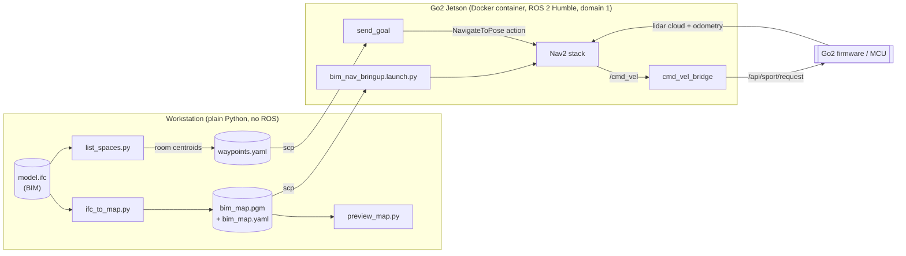
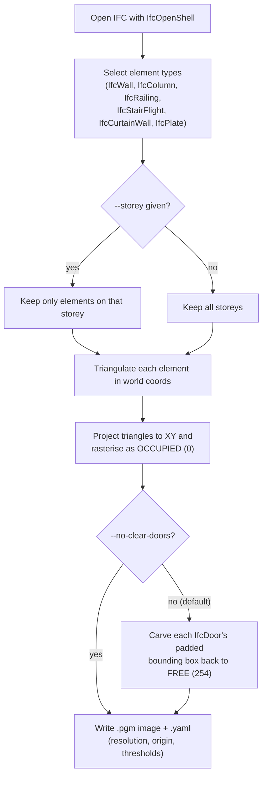
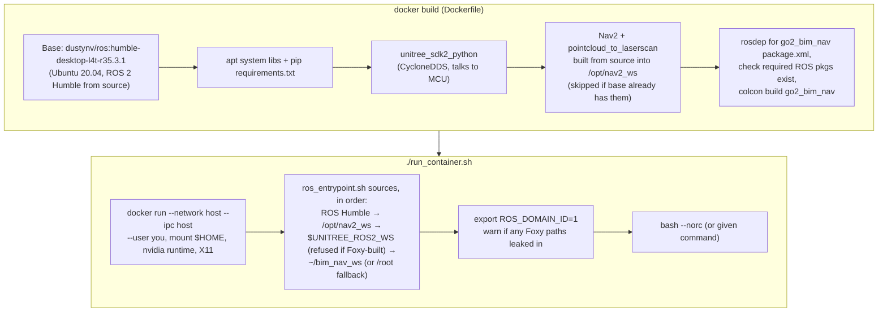
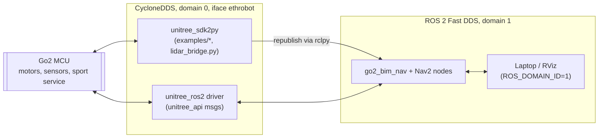
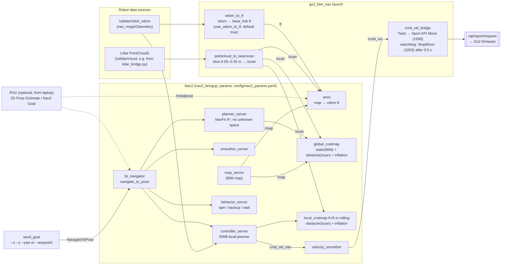
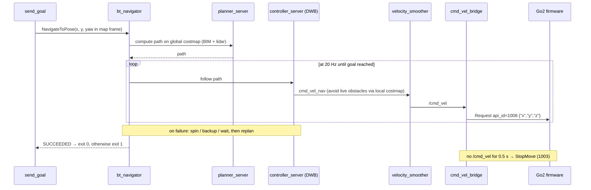

# Architecture overview

A rough, high-level map of how `go2_bim_nav` fits together. The diagrams are
Mermaid; GitHub and VS Code (with a Mermaid extension) render them inline.

The system has three phases:

1. **Offline map generation** on a workstation: IFC (BIM) model → 2D occupancy grid.
2. **Container build/startup** on the Go2's Jetson: Docker image with ROS 2 Humble + Nav2 + this package.
3. **Runtime navigation** on the dog: Nav2 localizes against the BIM map, plans, and drives the robot through the Unitree Sport API.

---

## 1. End-to-end



---

## 2. Offline: IFC → occupancy map (`ifc_to_map.py`)



Deliberately left out of the static map: slabs/ceilings/roofs (would blank
out whole rooms), doors (open/closed state unknown), and furniture (moves).
Anything not in the BIM is left for the live lidar obstacle layer.

---

## 3. Container build and startup



### Two DDS networks side by side



---

## 4. Runtime: navigation data flow

Started by `ros2 launch go2_bim_nav bim_nav_bringup.launch.py map:=... lidar_cloud_topic:=...`.



### TF tree

```mermaid
flowchart LR
    MAPF["map"] -->|amcl| ODOMF["odom"] -->|odom_to_tf<br/>(or lidar_restamp.py)| BASE["base_link"]
```

### What happens when a goal is sent



---

## 5. File map

| Path | Role |
| --- | --- |
| `Dockerfile`, `requirements.txt` | Image: ROS 2 Humble (L4T), unitree_sdk2py, Nav2 from source, builds the package |
| `run_container.sh` | Runs the image with host networking, your user, mounted `$HOME`, GPU/X11 |
| `ros_entrypoint.sh` | Sources the workspaces in order and sets `ROS_DOMAIN_ID=1` |
| `examples/lidar_bridge.py` | Robot lidar (`rt/utlidar/cloud_base`, domain 0) → ROS `/utlidar/cloud` |
| `examples/pub_test.py` | ROS networking smoke test (`/chatter`) |
| `examples/obstacles_avoid/*` | Standalone unitree_sdk2py tests of the firmware's own move/avoid APIs (independent of Nav2) |
| `src/go2_bim_nav/go2_bim_nav/ifc_to_map.py` | IFC → `.pgm` + `.yaml` (workstation) |
| `src/go2_bim_nav/go2_bim_nav/preview_map.py` | Shows a generated map with a metre grid (workstation) |
| `src/go2_bim_nav/go2_bim_nav/list_spaces.py` | Prints `IfcSpace` centroids for waypoints (workstation) |
| `src/go2_bim_nav/go2_bim_nav/odom_to_tf.py` | `/utlidar/robot_odom` → `odom → base_link` tf |
| `src/go2_bim_nav/go2_bim_nav/cmd_vel_bridge.py` | `/cmd_vel` → Unitree Sport API, with stop watchdog |
| `src/go2_bim_nav/go2_bim_nav/send_goal.py` | `NavigateToPose` client (coordinates or named waypoint) |
| `src/go2_bim_nav/launch/bim_nav_bringup.launch.py` | Starts pointcloud_to_laserscan, odom_to_tf, cmd_vel_bridge, nav2_bringup |
| `src/go2_bim_nav/config/nav2_params.yaml` | AMCL, costmaps, planner, DWB, smoother, behaviors |
| `src/go2_bim_nav/config/waypoints.yaml` | Named goals `{x, y, yaw}` in the map frame |
| `src/go2_bim_nav/maps/` | `Project1.ifc` sample model and the generated `bim_map.*` |

## Loose ends noticed while mapping this

- The package `README.md`/`WALKTHROUGH.md` still describe ROS 2 **Foxy** on the host, while the Docker setup is **Humble** (and `nav2_params.yaml` has been updated for Humble).
- `WALKTHROUGH.md` refers to `lidar_restamp.py` (an alternative `odom → base_link` publisher, used with `use_odom_to_tf:=false`), but that script isn't in the repo.
- `cmd_vel_bridge` needs `unitree_api` from a Humble-built `unitree_ros2` workspace (`UNITREE_ROS2_WS`), which is not part of the image.
- The firmware's own obstacle avoidance (`SWITCHAVOIDMODE`, see `examples/obstacles_avoid`) is separate from Nav2's; nothing in the launch sets it either way.
